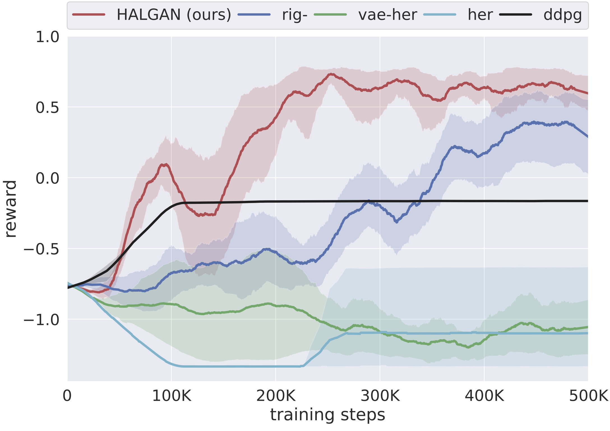

# HALGAN

## Contents
- [Introduction](#introduction)
- [Dependencies](#dependencies)
- [Usage](#usage)
- [Citation](#citation)

## Introduction
This repository contains code for the NeurIPS 2019 paper 
"Addressing Sample Complexity in Visual Tasks Using HER and Hallucinatory GANs".
Link to the paper: https://arxiv.org/pdf/1901.11529.pdf

A Hallucinatory GAN inserts a visual goal into failed trajectories during 
off-policy reinforcement learning. A corresponding reward is also hallucinated 
during batched sampling, if the task is hallucinated to be completed during 
the sampled transition. The combination of visual hallucinations and increased 
encounter with real and hallucinated rewards enable agents to quickly start 
learning sparse reward tasks.
This approach extends the [HER](https://arxiv.org/pdf/1707.01495.pdf) 
algorithm to visual settings.

<p align="center">
</img>
</img>
</p>

The left image shows various outputs of HALGAN in one of the environments. The 
goal is to navigate to a red box. The top left image shows an image from a 
failed trajectory where the goal is not in sight. In the remaining images,
HALGAN is asked to hallucinate the goal on top of the failed image in specific
locations, with increasing distance from top to bottom and increasing yaw from
left to right.
The right image shows the benefit of training using HALGAN vs. various
baselines. For a full explanation of the baselines and the training process
please refer to the paper.

## Dependencies
This code was developed using Python 3.5.2 on Ubuntu 16.04. In addition, the
following dependencies should be installed:
- [keras](https://keras.io/) (version 2.2.0)
- [Tensorflow](https://www.tensorflow.org/) (version 1.8.0)
- Offworld fork of [keras-rl](https://github.com/offworld-projects/keras-rl). Switch to branch offworld-halgan.
- Offworld fork of [gym-miniworld](https://github.com/offworld-projects/gym-miniworld/). Switch to branch offworld-halgan.

## Usage
This repository contains:
1. Code to train a HALGAN from scratch
2. Script for setting up training of a HALGAN equipped DDPG agent from 
offworld branch of keras-rl. Please refer to the 
[offworld keras-rl](https://github.com/offworld-projects/keras-rl) repository 
for code to a HALGAN DQN agent as well.
3. Data and trained models for the MiniWorld environment presented in the 
paper.

Simply run
```
cd src/
python train_halgan.py
```
to start training HALGAN on the MiniWorld task. Trained models will start
saving in `experiments/halgan-[ENV]/[datestamp]` along with some example
images. Training data for this environment is present in 
`data/MiniWorld-SimToReal1Cont-v0/training-data`. 

`data/MiniWorld-SimToReal1Cont-v0/` also contains a trained HALGAN model
for this environment. Run
```
cd src/
python train_ddpg.py
```
to start training a HALGAN DDPG agent that uses this model. Run
```
cd src/
python train_ddpg.py --mode vanilla
```
for vanilla DDPG comparison. Check `mode` argument for available baseline 
comparisons.

## Citation
Please use the following bibtex for citing this work in your publications

```
@inproceedings{sahni2019addressing,
title = {Addressing Sample Complexity in Visual Tasks Using HER and Hallucinatory GANs},
author = {Sahni, Himanshu and Buckley, Toby and Abbeel, Pieter and Kuzovkin, Ilya},
booktitle = {Advances in Neural Information Processing Systems 33},
year = {2019},
url = {https://arxiv.org/pdf/1901.11529.pdf}
}
```
